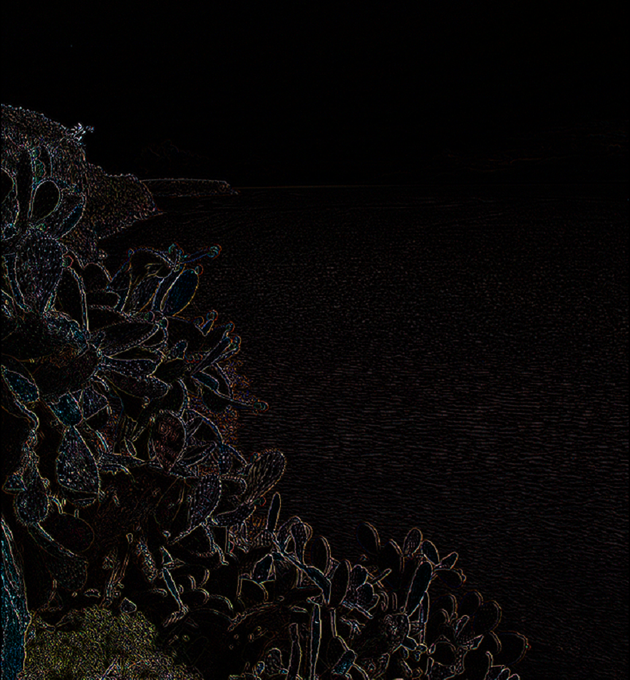
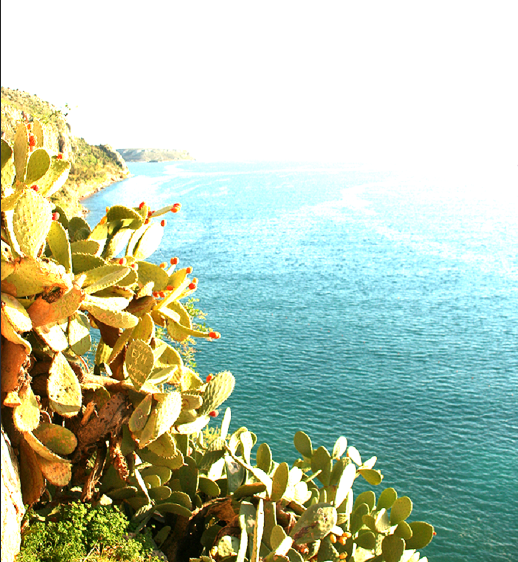

Image Before:

Run with command arguments: filter -f blur 10 Image05.ppm

After Blur Filter:

)

Run with command arguments: filter -f gamma 0.5 Image05.ppm

After Gamma Filter:

Run with command arguments: filter -f laplace Image05.ppm

After Laplace Filter:

Run with command arguments: filter -f linear 2 2 2 0 0 0 Image05.ppm

After Linear Filter:

